# SPA Deep Link: How It Works

This document describes the complete execution flow of the Obsidian-to-SPA system, from markdown files to a fully navigable single-page application.

---

## System Architecture Diagram

```mermaid
flowchart TB
    subgraph BUILD["🔧 BUILD PHASE (Python)"]
        direction TB
        VAULT[("📁 Obsidian Vault<br/>(.md files)")]
        TRANSLATE["translate.py<br/>MD → HTML Parser"]
        READY[("📁 try_hosting_Vault_ready_2_serve<br/>(.html + .md files)")]
        MANIFEST_PY["build_manifest.py"]
        MANIFEST[("📄 manifest.json")]
        
        VAULT --> TRANSLATE
        TRANSLATE --> READY
        READY --> MANIFEST_PY
        MANIFEST_PY --> MANIFEST
    end
    
    subgraph SERVE["🌐 SERVE PHASE (Static Host)"]
        direction TB
        HOST["Static Host<br/>(Cloudflare / GitHub Pages)"]
        INDEX["index.html<br/>(SPA Shell)"]
        APPJS["app.js<br/>(Router)"]
        STYLES["styles.css"]
        HTML_CHUNKS[("HTML Content<br/>Chunks")]
    end
    
    subgraph CLIENT["🖥️ CLIENT RUNTIME (Browser)"]
        direction TB
        
        subgraph INIT["Initialization"]
            LOAD_PAGE["Browser loads<br/>index.html"]
            REDIRECT_HACK["404 Redirect Hack<br/>(sessionStorage)"]
            ROUTER_INIT["Router()<br/>constructor"]
            FETCH_MANIFEST["loadManifest()<br/>fetch manifest.json"]
            FLATTEN["flattenManifest()<br/>Build routes lookup"]
            BUILD_NAV["buildNav()<br/>Create Home|About|Notes"]
        end
        
        subgraph RENDER["Render Cycle"]
            RENDER_START["render()"]
            CHECK_STATIC{"Static Page?<br/>/ or /about"}
            RENDER_STATIC["Render inline content"]
            CHECK_ROUTE{"Route exists?"}
            RENDER_404["renderNotFound()"]
            FETCH_CONTENT["fetchContent()<br/>GET HTML chunk"]
            BUILD_BREAD["buildBreadcrumbs()"]
            BUILD_FILES["buildFilesAndDirs()"]
            INJECT_HTML["innerHTML = content"]
            PROCESS_LINKS["processContentLinks()<br/>Fix wiki-links"]
            UPDATE_NAV["updateActiveNav()"]
        end
        
        subgraph NAVIGATION["User Navigation"]
            CLICK["User clicks<br/>data-link anchor"]
            INTERCEPT["Event listener<br/>e.preventDefault()"]
            PUSH_STATE["history.pushState()"]
            POPSTATE["popstate event<br/>(back/forward)"]
        end
    end
    
    %% Build to Serve connections
    MANIFEST --> HOST
    READY --> HOST
    HOST --> INDEX
    HOST --> APPJS
    HOST --> STYLES
    HOST --> HTML_CHUNKS
    
    %% Client initialization flow
    INDEX --> LOAD_PAGE
    LOAD_PAGE --> REDIRECT_HACK
    REDIRECT_HACK --> ROUTER_INIT
    ROUTER_INIT --> FETCH_MANIFEST
    FETCH_MANIFEST --> FLATTEN
    FLATTEN --> BUILD_NAV
    BUILD_NAV --> RENDER_START
    
    %% Render cycle flow
    RENDER_START --> CHECK_STATIC
    CHECK_STATIC -->|Yes| RENDER_STATIC
    CHECK_STATIC -->|No| CHECK_ROUTE
    CHECK_ROUTE -->|No| RENDER_404
    CHECK_ROUTE -->|Yes| FETCH_CONTENT
    FETCH_CONTENT --> BUILD_BREAD
    BUILD_BREAD --> BUILD_FILES
    BUILD_FILES --> INJECT_HTML
    INJECT_HTML --> PROCESS_LINKS
    PROCESS_LINKS --> UPDATE_NAV
    RENDER_STATIC --> UPDATE_NAV
    
    %% Navigation loop
    CLICK --> INTERCEPT
    INTERCEPT --> PUSH_STATE
    PUSH_STATE --> RENDER_START
    POPSTATE --> RENDER_START
    
    %% Styling
    classDef buildPhase fill:#e1f5fe,stroke:#0288d1
    classDef servePhase fill:#f3e5f5,stroke:#7b1fa2
    classDef clientPhase fill:#e8f5e9,stroke:#388e3c
    classDef decision fill:#fff3e0,stroke:#f57c00
    
    class VAULT,TRANSLATE,READY,MANIFEST_PY,MANIFEST buildPhase
    class HOST,INDEX,APPJS,STYLES,HTML_CHUNKS servePhase
    class LOAD_PAGE,REDIRECT_HACK,ROUTER_INIT,FETCH_MANIFEST,FLATTEN,BUILD_NAV clientPhase
    class CHECK_STATIC,CHECK_ROUTE decision
```



---

## Execution Flow Details

### Phase 1: Build (Offline)

The build phase converts your Obsidian vault into servable content.

#### Step 1.1: Markdown to HTML Translation

```shell
python translate.py /path/to/obsidian_vault
```

| Input | Output |
|-------|--------|
| `nature/desert.md` | `nature/desert.html` |
| `README.md` | `README.html` |
| `graphics/*.png` | Copied as-is |

**Parsing Rules Applied:**
1. **README Signal** — Only directories containing `README.md` are valid
2. **Graphics Exception** — `graphics/` directories skip the README requirement

#### Step 1.2: Manifest Generation

```shell
python build_manifest.py ./try_hosting_Vault_ready_2_serve > manifest.json
```

The manifest builder:
1. Recursively walks the output directory
2. Skips `graphics/` directories entirely
3. Creates `directory` nodes for folders with `README.md`
4. Creates `file` nodes for non-README `.html` files
5. Outputs a nested JSON tree

**Manifest Node Schema:**
```typescript
interface ManifestNode {
  type: "directory" | "file";
  title: string;           // Display name
  slug: string;            // URL path segment (e.g., "nature/tundra")
  content_path: string;    // Path to HTML file (e.g., "/nature/README.html")
  children?: ManifestNode[]; // Only for directories
}
```

---

### Phase 2: Serve (Static Host)

The application runs on any static host. Two hosting modes are supported:

#### Mode A: Cloudflare Workers/Pages (Recommended)

Configuration in `wrangler.jsonc`:
```jsonc
{
  "assets": {
    "not_found_handling": "single-page-application"
  }
}
```
- All 404s return `index.html` with original URL preserved
- No redirect hack needed

#### Mode B: GitHub Pages / Netlify

Uses `404.html` redirect hack:
```
/notes/nature/arctic
       ↓ (404)
404.html stores URL in sessionStorage
       ↓ (redirect to /)
index.html reads sessionStorage
       ↓ (history.replaceState)
URL restored, router renders /notes/nature/arctic
```

---

### Phase 3: Client Runtime (Browser)

#### 3.1 Initialization Sequence


#### 3.2 Route Flattening

The nested manifest is flattened into a lookup table for O(1) routing:

```javascript
// Before (nested tree)
manifest.root.children[2].children[1]  // nature/tundra

// After (flat lookup)
routes["/notes/nature/tundra"]  // Direct access
```

#### 3.3 Render Cycle

For each navigation:

| Step | Function | Purpose |
|------|----------|---------|
| 1 | `render()` | Entry point, gets `location.pathname` |
| 2 | Check `staticPages` | Handle `/` and `/about` |
| 3 | Lookup `routes[path]` | Find manifest node |
| 4 | `fetchContent()` | GET HTML chunk (cached) |
| 5 | `buildBreadcrumbs()` | Generate `Notes / nature / tundra` trail |
| 6 | `buildFilesAndDirs()` | Two-column file/directory listing |
| 7 | `processContentLinks()` | Fix internal wiki-links |
| 8 | `updateActiveNav()` | Highlight current tab |

#### 3.4 Link Processing

Content HTML may contain wiki-style links that need transformation:

```html
<!-- Original (from translated markdown) -->
<a href="/about">about</a>

<!-- After processContentLinks() -->
<a href="/notes/about" data-link>about</a>
```

The function:
1. Finds all `<a>` elements in `.content`
2. Skips external links (`http://`, `#`)
3. Prepends `/notes` to absolute paths
4. Resolves relative paths from current directory
5. Adds `data-link` for SPA routing

---

## File Reference

| File | Purpose |
|------|---------|
| `index.html` | SPA shell with nav container and #app |
| `app.js` | Router, manifest loader, render logic |
| `styles.css` | Layout and component styles |
| `manifest.json` | Nested content tree (generated) |
| `404.html` | Deep link redirect hack |
| `wrangler.jsonc` | Cloudflare deployment config |
| `build_manifest.py` | Generates manifest from vault |
| `Parsing Rules.md` | Documentation of vault structure rules |

---

## Data Flow Summary

```
┌─────────────────────────────────────────────────────────────────────────────┐
│                           COMPLETE DATA FLOW                                │
├─────────────────────────────────────────────────────────────────────────────┤
│                                                                             │
│  Obsidian Vault                                                             │
│       │                                                                     │
│       ▼                                                                     │
│  translate.py ──────────▶ HTML Chunks (try_hosting_Vault_ready_2_serve/)   │
│       │                         │                                           │
│       │                         ▼                                           │
│       │                   build_manifest.py                                 │
│       │                         │                                           │
│       │                         ▼                                           │
│       │                   manifest.json                                     │
│       │                         │                                           │
│       ▼                         ▼                                           │
│  ┌─────────────────────────────────────────────────────────────────────┐   │
│  │                     STATIC HOST                                      │   │
│  │  index.html + app.js + styles.css + manifest.json + HTML chunks     │   │
│  └─────────────────────────────────────────────────────────────────────┘   │
│                                 │                                           │
│                                 ▼                                           │
│  ┌─────────────────────────────────────────────────────────────────────┐   │
│  │                        BROWSER                                       │   │
│  │                                                                      │   │
│  │  1. Load index.html                                                  │   │
│  │  2. Fetch manifest.json → flattenManifest() → routes{}              │   │
│  │  3. User clicks link → history.pushState() → render()               │   │
│  │  4. render() → fetchContent() → display HTML chunk                  │   │
│  │  5. processContentLinks() → fix wiki-links                          │   │
│  │                                                                      │   │
│  └─────────────────────────────────────────────────────────────────────┘   │
│                                                                             │
└─────────────────────────────────────────────────────────────────────────────┘
```

---

## Key Design Decisions

### 1. Why Nested Manifest + Flat Routes?
- **Nested manifest** preserves hierarchy for UI (breadcrumbs, file listings)
- **Flat routes** enable O(1) path lookup during navigation

### 2. Why Fetch Content on Demand?
- Smaller initial payload (only manifest, not all content)
- Content is cached after first fetch
- Better performance for large vaults

### 3. Why Prefix Vault Routes with `/notes`?
- Separates vault content from static pages (Home, About)
- Allows future expansion (settings, search, etc.)
- Clear URL semantics: `/notes/physics/golden_file`

### 4. Why Process Links After Render?
- HTML content is pre-generated (doesn't know SPA routing)
- Wiki-links need `data-link` attribute for SPA interception
- Paths need `/notes/` prefix transformation

---

## Usage

### Development
```shell
# Start local server
python3 -m http.server 8080

# Open browser
open http://localhost:8080
```

### Build Manifest
```shell
python build_manifest.py ./try_hosting_Vault_ready_2_serve > manifest.json
```

### Deploy to Cloudflare
```shell
npx wrangler pages deploy ./
```
